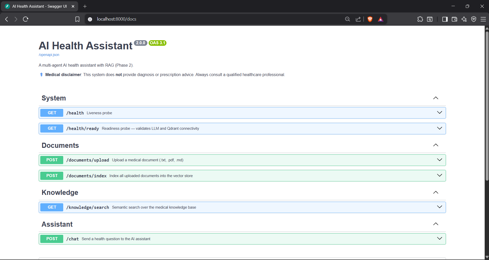
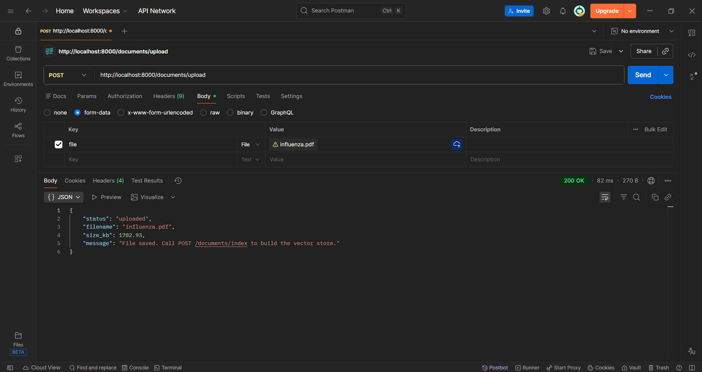
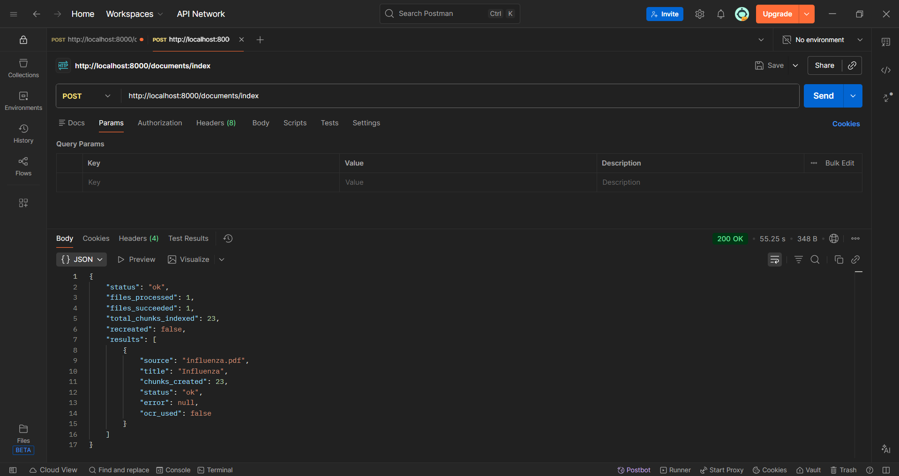
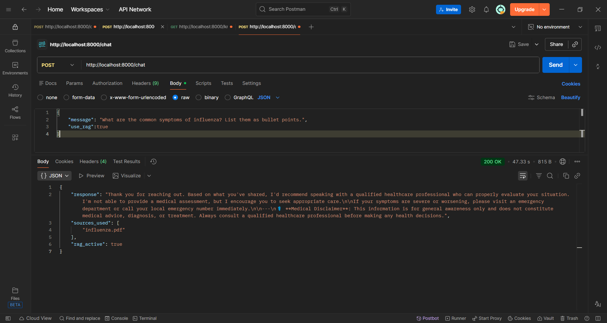
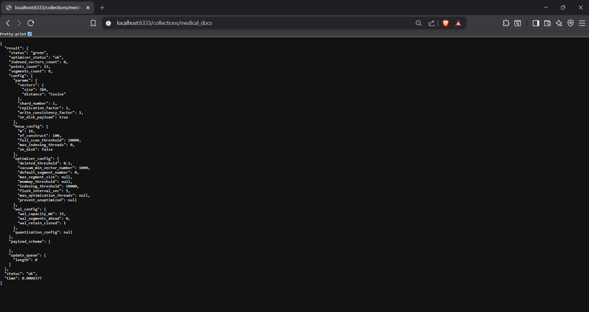

# 🩺 AI Health Assistant

> A multi-agent AI Health Assistant built with **FastAPI**, **Ollama (Llama 3)**, **Qdrant**, and **Retrieval-Augmented Generation (RAG)** to provide context-aware healthcare guidance using indexed medical documents.


---

# 📖 Overview

AI Health Assistant is a **multi-agent healthcare assistant** that combines **Retrieval-Augmented Generation (RAG)** with a **local Large Language Model (Llama 3 via Ollama)** to generate context-aware healthcare responses from indexed medical documents.

Instead of relying solely on an LLM, the system retrieves relevant information from a **Qdrant vector database**, improving factual grounding and reducing hallucinations. The project demonstrates modern AI engineering concepts including agent orchestration, semantic search, vector databases, REST API development, and containerized deployment.

> **Disclaimer:** This project is intended for educational and research purposes only. It does not provide medical diagnosis or treatment.

---

# 🚀 Project Highlights

- 🤖 Multi-Agent AI Architecture
- 🧠 Retrieval-Augmented Generation (RAG)
- ⚡ FastAPI REST Backend
- 🦙 Local LLM using Ollama (Llama 3)
- 🔍 Semantic Search with Qdrant
- 📄 Medical PDF Knowledge Base
- 🧪 Comprehensive Unit Testing
- 🐳 Docker Support

---

# ✨ Features

- Multi-agent AI workflow
- Context-aware healthcare responses
- Medical PDF ingestion and indexing
- Semantic search using vector embeddings
- Local LLM inference using Ollama
- FastAPI REST APIs
- Emergency-aware response routing
- Safety-focused response generation
- Unit-tested backend
- Docker support

---


# 🔄 Workflow

```text
                    User
                      │
                      ▼
              FastAPI Backend
                      │
                      ▼
        Health Assistant Orchestrator
                      │
        ┌─────────────┼──────────────┐
        ▼             ▼              ▼
 Router Agent   Emergency Agent   Safety Agent
        │
        ▼
  Symptom Agent
        │
        ▼
    RAG Pipeline
        │
   ┌────┴─────┐
   ▼          ▼
Qdrant     Ollama (Llama 3)
   ▲
   │
Medical Documents
```

---

# 🛠️ Tech Stack

| Category | Technologies |
|------------|-------------|
| Language | Python |
| Backend | FastAPI |
| LLM | Ollama (Llama 3) |
| Vector Database | Qdrant |
| Embeddings | Sentence Transformers |
| PDF Processing | PyPDF |
| Testing | Pytest |
| Containerization | Docker |

---

# 📂 Project Structure

```text
AI_HEALTH_ASSISTANT
│
├── agents/
├── core/
├── knowledge/
├── documents/
│   └── uploads/
├── tests/
├── assets/
├── docs/
│   └── EXECUTION_GUIDE.md
│
├── Dockerfile
├── main.py
├── requirements.txt
└── README.md
```

---

# 🚀 Quick Start

Clone the repository

```bash
git clone https://github.com/VishwanathBabu/ai-health-assistant.git

cd ai-health-assistant
```

Create a virtual environment

```bash
py -3.10 -m venv venv
```

Activate the virtual environment

**Windows**

```bash
venv\Scripts\activate
```

Install dependencies

```bash
pip install -r requirements.txt
```

Run the application

```bash
python -m uvicorn main:app --reload
```

Open Swagger UI

```text
http://localhost:8000/docs
```

For detailed setup instructions, refer to **docs/EXECUTION_GUIDE.md**.

---

# 🔌 API Endpoints

| Endpoint | Description |
|------------|-------------|
| `POST /chat` | Generate AI-powered healthcare responses |
| `POST /documents/upload` | Upload medical documents |
| `POST /documents/index` | Build the vector database |
| `GET /knowledge/search` | Perform semantic search |
| `GET /health` | Service health check |
| `GET /health/ready` | Readiness check |

---

# 📸 Screenshots

## Swagger UI



---

## Upload Medical Documents



---

## Document Indexing



---


## Chat Response



---

## Qdrant Collection

Shows the indexed medical document collection and vector metadata.



---

# 🧪 Running Tests

Run all tests

```bash
pytest tests/ -v
```

---

# 📚 Documentation

Detailed documentation is available in:

📄 **[Execution Guide](docs/EXECUTION_GUIDE.md)**

The execution guide includes:

- Project setup
- Python environment configuration
- Ollama installation
- Qdrant installation
- API testing using Postman
- Document ingestion
- Docker setup
- Testing
- Troubleshooting

---

# 🔮 Future Improvements

- OCR support for scanned PDFs
- Conversation memory
- User authentication
- Multi-language support
- Cloud deployment
- Streaming responses
- Expanded medical knowledge base

---

# ⚠️ Disclaimer

This project is intended **only for educational and research purposes**.

It does **not** provide medical diagnosis, prescriptions, or treatment recommendations.

Always consult a qualified healthcare professional for medical advice.

---

# 👨‍💻 Author

**Vishwanath Babu**

Computer Science Undergraduate | AI & Backend Developer

---

## ⭐ Support

If you found this project useful, consider giving it a ⭐ on GitHub!
